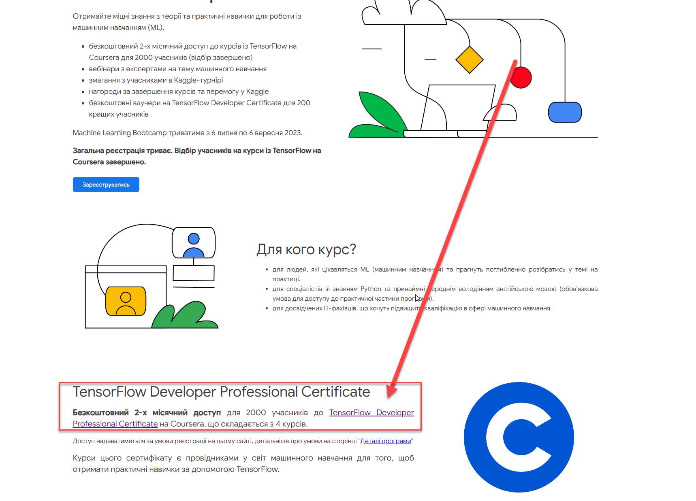
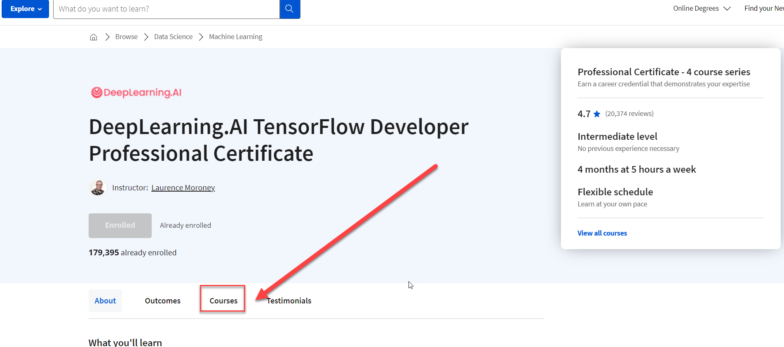
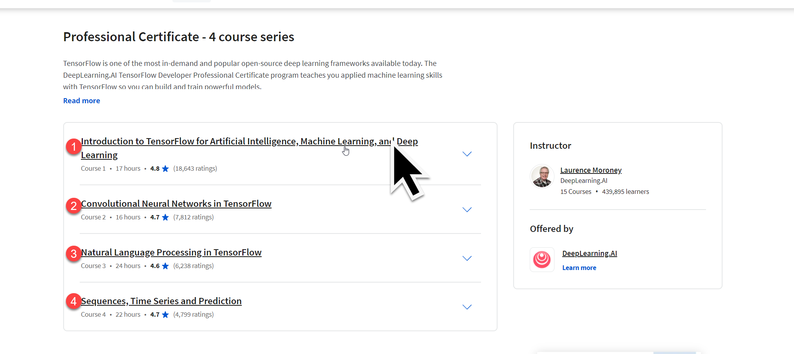
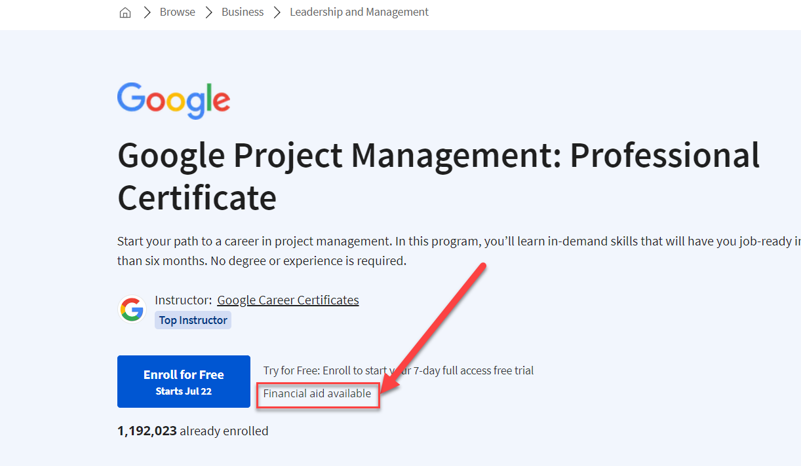

# Coursears Finanical aid Easy

- [ML Bootcamp Ukraine](https://rsvp.withgoogle.com/events/ml-bootcamp-ukraine/forms/registration)

### Recomended coursrs

- [AI for Everyone](https://www.coursera.org/learn/ai-for-everyone?)

- [Learning how to learn](https://www.coursera.org/learn/learning-how-to-learn?)
- [Crash course for Python](https://www.coursera.org/learn/python-crash-course?)
- [AI for Good](https://www.coursera.org/specializations/ai-for-good?)


### Instruction for Dummies or retarded







## Promit Reason you Applied for Aid 

```powershell

$name = "Vasia Popkin"
$job = "gameDev"
$age = 28

"My name is {$name} I am {$age} applying for Financial AId on Courseara platform and my reasons for that is: 

❗Put you're own reasons 

- Education is important for me because I wana build tech career
- I wana get high paid job in fututure for my family 
- As Russian-Ukraine war strike as Ukrainian refugee it's for me to find 
- I am trying to change from {$job} into ML becaus of high market dement 
- In 2023 I hope to find I good job in USA

Write 160-200 words reasoning for applying for financial aid for first person.
"

```

### Promt for " How will your selected course help with your goals?"

```

Write 150-250 words anwser on Topic from first person Ukrainian SWE  who is highly intellegent but hasetent to ask for another Financial aid to help with his education. By answering on the question :


"How Following couse will help me to achive my goals ?"

1. My bacground: 

{$AnswerfFromFirstPromt}

2. Course Description:

{Course Descritption}


```

#### Example


<details>
  <summary>Personal Example that I applie</summary>
  <p>This course aligns perfectly with my professional goals as a Ukrainian software engineer, as well as my broader aspirations. I've been in a situation of extreme financial hardship and personal uncertainty due to the ongoing war in Ukraine. This financial instability has hindered my ability to finance my education and strive for a prosperous future. However, I recognize that education is a key tool for change and I'm resolute to persevere.</p>

<p>The Google Data Analytics Certificate would not only supplement my software engineering background but also catapult me into the burgeoning field of data analytics, a domain of significant interest to me. The skills gained from this course—data cleaning, analysis, and visualization, as well as familiarity with tools like SQL, R programming, and Tableau—would greatly enhance my employability and open doors to high-demand roles. As data is the new oil, having data analytics skills is no longer optional; it's a necessity.</p>

<p>Furthermore, aiming to migrate to Canada or the USA, the Google certificate would increase my appeal to potential employers abroad, making the transition smoother. I also plan to utilize this education to contribute to my community back in Ukraine, leveraging data-driven insights to address pressing issues.</p>

<p>Despite my hesitance in seeking financial aid again, I firmly believe that the potential this course holds for my future is immense. It is a bridge to my professional aspirations, a beacon in my journey towards financial stability, and a catalyst for positive change both for myself and my homeland.</p>
</details>


